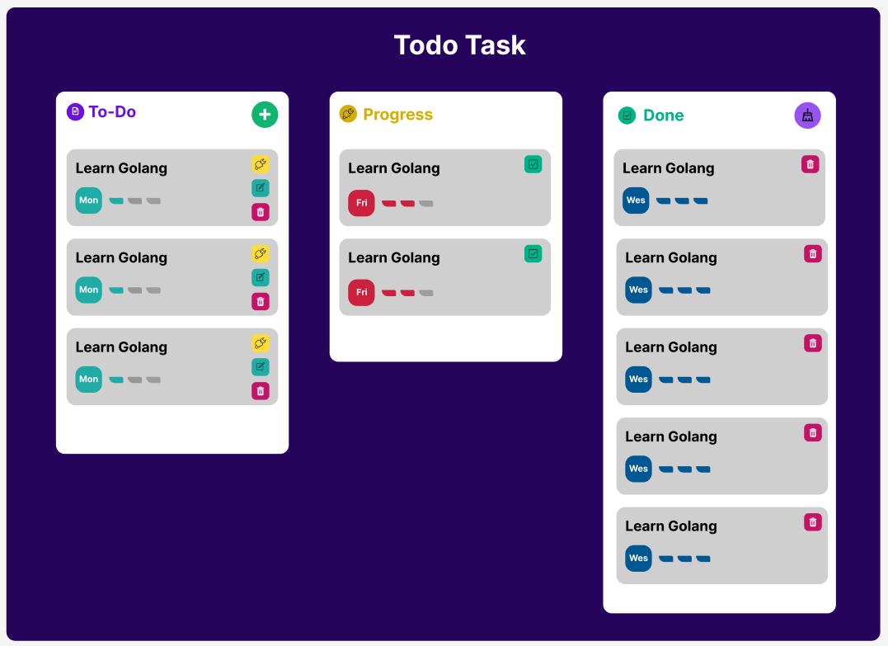

This is a [Next.js](https://nextjs.org/) project bootstrapped with [`create-next-app`](https://github.com/vercel/next.js/tree/canary/packages/create-next-app).

## Getting Started

### Design here:


First, set up project:
```bash
# Install turbo
npm install --global turbo

# Install package of project
pnpm install
#or
npm install
```

Second, change your URL Database <br />
<code>
  DATABASE_URL=[your-url-database]
</code>

Third, run the development server:

```bash
# Generate schema
pnpm run prisma:generate

# Run project
turbo dev
# or
pnpm dev
```


Open [http://localhost:3000](http://localhost:3000) with your browser to see the result.

You can start editing the page by modifying `app/page.tsx`. The page auto-updates as you edit the file.

This project uses [`next/font`](https://nextjs.org/docs/basic-features/font-optimization) to automatically optimize and load Inter, a custom Google Font.

## Learn More

To learn more about Next.js, take a look at the following resources:

- [Next.js Documentation](https://nextjs.org/docs) - learn about Next.js features and API.
- [Learn Next.js](https://nextjs.org/learn) - an interactive Next.js tutorial.

You can check out [the Next.js GitHub repository](https://github.com/vercel/next.js/) - your feedback and contributions are welcome!

To learn more about tRPC, take a look at the following resources:

- [tRPC Documentation](https://trpc.io/docs/) - learn about tRPC features and API.

You can check out [the trpc GitHub repository](https://github.com/trpc/trpc) - your feedback and contributions are welcome!